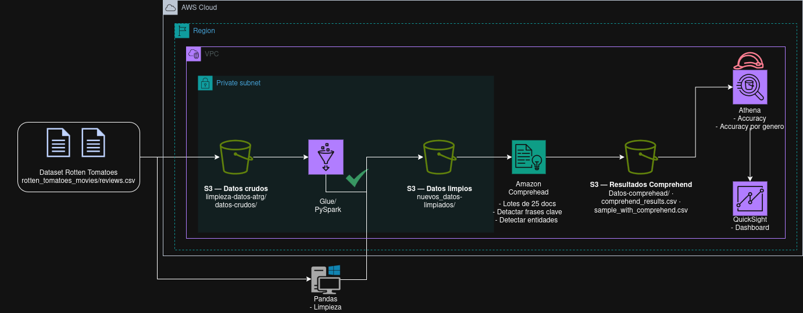

# Cinefilia en AWS
Proyecto de IA donde implementamos un pipeline de Bedrock.

## Primera parte
Limpieza de las reseñas de los usuarios sobre las películas del año *2000* en adelante, tomando los siguientes criterios:

- Reseñas de al menos 30 palabras
- Normalización de caracteres especiales

# Datos usados

Utilizaremos un dataset de [películas y reseñas en Rotten Tomatos](https://www.kaggle.com/datasets/andrezaza/clapper-massive-rotten-tomatoes-movies-and-reviews).
Las columnas a utilizar son las siguientes:

## Columnas para reseñas:
- id
- creationDate
- reviewText
- scoreSentiment
- reviewState

## Columas para películas:
- id
- title
- genre
- audienceScore
- tomatoMeter
- releaseDateTheaters
- releaseDateStreaming

# Participantes
- Aco
- Alan Miguel Crispin Rivera
- Alan Tonatiuh Romero Garcia
- Daniel B.
- Emmanuel Morales Hernández
- Evelyn B.
- Evert Cardenas
- Karen Marquez
- Luis Miguel Sánchez
- Morthi
- Rodrigo :D
